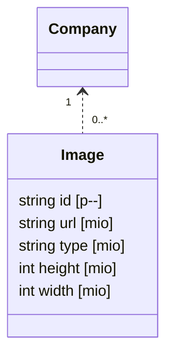

# Image

## Model

項目分類
- i: in: inの項目
- o: out: outの項目
- k: key: inだがkey項目として扱うので例えばjsonなどには含まれず、path parameterなどで扱う
- c: context: 前提条件として既に存在するエンティティのキー
- m: member: modelの項目
- p: primary: modelの主キー
- u: unuque: modelのユニークキー
- v: virtual: sqlで仮想的に定義する項目

## Directory
- controller
- in
- out
- model
- record
- repository
- mock
- schema

## Enum
Nothing

## Repository
- Database.SqlExecutor
- local.Localer

## Mutation
- CreateImage(company Company, entry ImageGetter): Image { Image }

## Query
- GetImageById(entry IdGetter): []Image

## Property
- Image.id = local.GenerateID()
- Image.url = s3やcloud storageのURL
- Image.type = image/jpeg, image/pngなどのMIMEタイプ

## Controller
- CreateImage  
  Database.Transact
  company = Company.GetCompanyByCode(entry)
  return Image.CreateImage(company, entry)
  Database.Close
- GetImage  
  image = Image.GetImageById(entry)  
  company = Company.GetCompanyById(image.company_id)
  return Basic.Relate(image, company)
  Database.Close

## Interface
- POST /company/{company_code}/image
  CreateImage  
- GET  /company/{company_code}/image/{image_code}
  GetImage  

## Note
- 本来は別システムでCompanyなどと同等の扱い
- ただ機能上あるとわかりやすいので、余裕があればCreateImageも実装する。
- GetImageは常に必要

