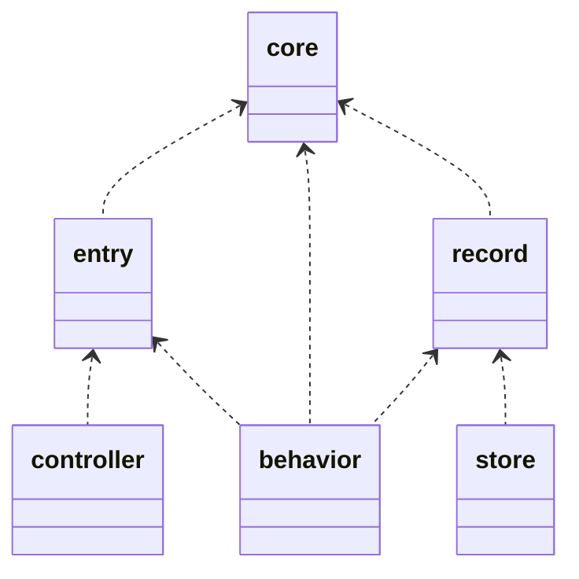
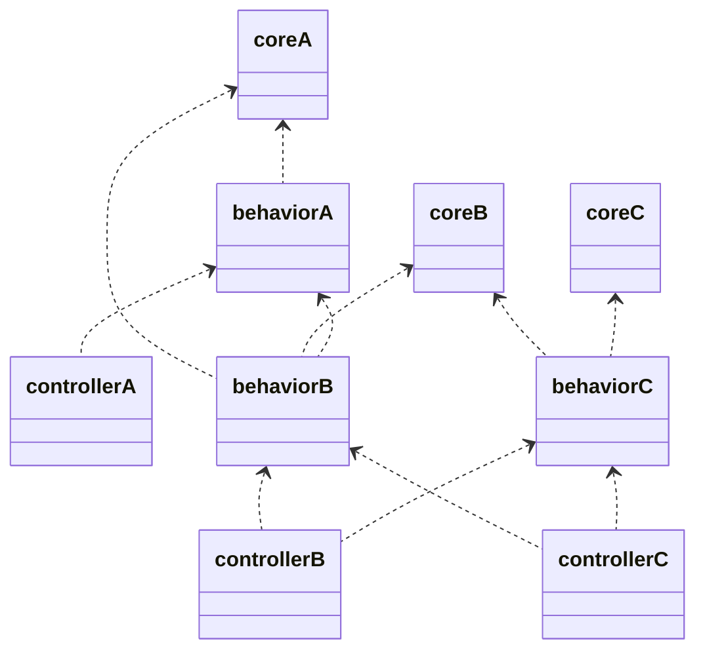

# Package Guide

主にプロジェクトルートに切られたpkgディレクトリ以下のPackage構成についての解説。

## Directory

### pkg

集約ごとにディレクトリを切り、その下に以下のファイル、ディレクトリを配置する。
```
pkg/
  route.go
  command.go
  job.go
  company/ <- Company集約、以降同様
  item/
  user/
  payment/
```

集約同士の関連は、[docs/aggregate.md](docs/aggregate.md)を参照。  
開発時は各集約の設計が必要になるが、それらは`docs/draft`配下に配置したい。  

### 集約
特定の集約配下は、以下の構成とする。
それぞれのディレクトリ以下には、さらに深くディレクトリを切らず、ファイルを配置するのみ。
companyは例であって、任意の集約名が入る。  

```
company/
  route.go
  command.go
  job.go
  core/
  entry/
  exit/
  record/
  store/
  behavior/
  controller/
  schema/
```

各ディレクトリ、ファイルの役割は、以下となる。
詳細は、[docs/guildeline/coding/index.md](docs/guildeline/coding/index.md)を参照。
- core
  いわゆるドメインモデルであり、副作用のないロジックやビジネスルールを定義する。
- entry
  システムへの入力を定義し、coreに変換されるデータを定義する。
- exit
  システムからの出力を定義し、coreから変換されるデータを定義する。
- record
  DBのレコードを定義する。coreに書き込んで足りる場合は、coreで完結させ、recordは用意しない。
- store
  DBへのアクセスを定義し、behaviorから呼ばれる。joinがない、条件が単純なクエリはbehaviorで完結させ、storeは用意しない。
- behavior
  集約としてのデータの更新、参照の処理を定義する。
- controller
  複数の集約のbehaviorを取りまとめて、外部から呼ばれる機能を定義する。複数の集約を取り扱うが、中心となる集約があるので、その集約に配置される。
- schema
  DBのスキーマを定義するマイグレーションファイルを配置する。  

### (route|command|job).go
pkg配下にも、集約配下にも、route.go,command.go,job.goを配置する。  
どちらも同様の役割を持ち、pkg配下のものは、集約配下のものを取りまとめるという構成になる。  
こちらも詳細は、[docs/guildeline/coding/index.md](docs/guildeline/coding/index.md)を参照。  

- route.go
  web serverのURL Routingを定義する。
- command.go
  cli commandの定義をする。
- job.go
  非同期処理のエントリーポイントの定義をする。

## 依存関係図

各ディレクトリ、ファイルの役割は、[docs/guildeline/coding/index.md](docs/guildeline/coding/index.md)に定義している。  
集約配下のpackageの依存関係は以下となる。  



集約間とそれ以下のpackageを含めた依存関係は以下となる。  
集約間の依存関係が`A<-B<-C`の場合、core,behaviorはその依存関係を守る。  
controllerのみ`C<-B`のような逆方向にも依存可能とする。  
storeは集約をまたぐ依存はなく、entry,exit,recordはcoreに準じた依存関係。  



## その他

### デフォルト集約
pkg配下でデフォルトで用意しているツール群  
基本的に使うでしょうというイメージ  

- database  
  データベース接続関連  
  他の集約と違いcoreのふるまいに副作用がある。こちらのbehaviorはこのcoreを取得する処理を提供する。
- local  
  日付、乱数、ファイル、別プロセスの起動など、システムに問い合わせて値を取得するような処理を配置する。  
  日付、乱数などは、利用頻度が高いので常用されているが、副作用のある処理であるというのが前提。  
  環境変数取得、設定値管理なども  
- basic  
  string,listなど組み込み型の拡張機能  
  webシステムであればpagination等の汎用的な概念もこちらに配置する。  

### utility
utilityは基本存在しないはず。多くはbasicやlocalに含まれる。  
また、controllerで利用するものは、basic,databaseのcontrollerなど、何かしらのpkgに含まれるはずなので、検討する。  
stringやdatabaseなどは前述のデフォルト集約に含まれる。そのほか単一の関心事項にフォーカスする関数などは適切な集約配下に配置する。
集約を横断して利用するのは、主にcontroller層であるため、デフォルト集約にもcontrollerディレクトリを用意している。独自middlewareなどもこれらに配置したい。

