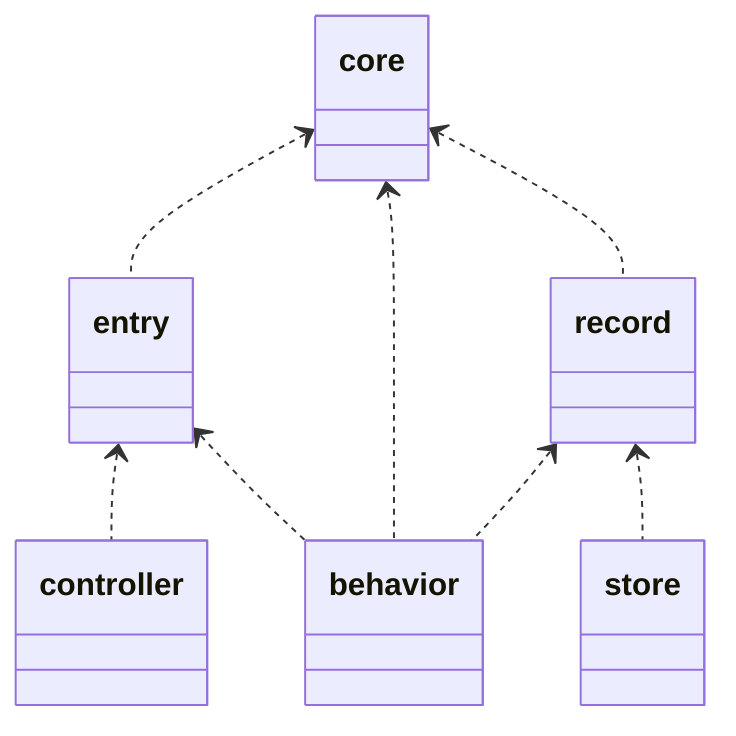
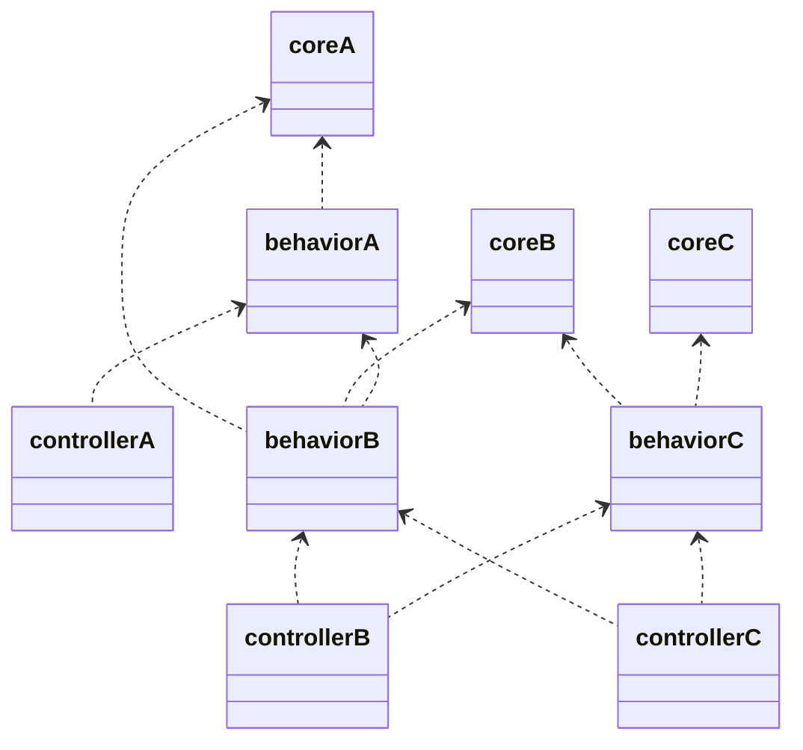

# Modules

モジュール構成についての解説。  
モデリング自体はaggregate.mdに記載しているが、それらをどう実装するのかについての指針を示す。

## 概要

ディレクトリの全体概要は以下の通り

- cmd
  - server
    - main.go
  - job
    - main.go
- pkg
  - route.go
  - command.go
  - interface_behavior.go
  - store.go
  - ..EachAggregate
    - route.go
    - command.go
    - controller
    - entry
    - record
    - plain
    - behavior
    - mock
    - store
    - schema

## 各ディレクトリの説明

### cmd
アプリケーションのエントリポイント  
webサーバの起動もそうだが、業務上cliコマンドの作成もよくある事例なので用意している。  

### pkg
特定のドメインモデルの集約を表現する  
集約単位でディレクトリを切り、その中に様々な実装を施す。詳細は別途記載  

### デフォルト集約
pkg配下でデフォルトで用意しているツール群  
基本的に使うでしょうというイメージ  

- database  
  データベース接続関連  
- local  
  日付、乱数、ファイル、別プロセスの起動など、メモリとcpuの外に出る際の機能を提供する  
  環境変数取得、設定値管理なども  
- basic  
  string,配列など組み込み型の拡張機能  

### utility
utilityは基本存在しないはず。多くはbasicやlocalに含まれる。  
また、controllerで利用するものは、basic,databaseのcontrollerなど、何かしらのpkgに含まれるはずなので、検討する。  
stringやdatabaseなどは後述するデフォルトAggregateに含まれる。そのほか単一の関心事項にフォーカスする関数などは適切なAggregate配下に配置する。
Aggregateを横断して利用するのは、主にcontroller層であるため、controllerディレクトリを用意している。独自middlewareなどもここに配置したい。

## pkg以下のディレクトリ

### route&command
route.goはwebのurl route定義、command.goはcliコマンド定義を行う。
各Aggregate配下に用意し、Aggregateごとのroute,commandを定義し、それを統括する定義をpkg直下に用意する。

### interface
behavior,storeのinterfaceを配置する  
循環参照を避けるため、behaviorのinterfaceは`behavior`ディレクトリ配下の専用ファイル（例: `behavior/image.go`）に配置する。  
storeのinterfaceはディレクトリではなく、トップレベルにファイルとして用意

### controller  
modelのふるまいを統合して、機能を提供する。アプリケーションのインタフェースとしての役割  
webであれば、routingに紐づける  
他の集約のbehaiviorを利用する。behaiviorはinterfaceで依存注入されるので、実装依存はしない。  
その際、依存しているもののみならず、被依存しているものも利用する。特にDBレコードを集計する場合などによくある。  
behaiviorと違い、1関数1構造体という形をとる。controllerの関数ごとに、依存しているpkgが違うため。  
各controllerは2種類のファクトリ関数を持つ:  
- `NewXXXControl`: 依存を受け取ってセットするだけのコンストラクタ（テスト用）  
- `CreateXXXControl`: DB接続やLocalerの初期化を含む実際のコンストラクタ（本番用、内部でNewXXXControlを呼び出す）  
controllerはいわゆるドメインレイヤ/アプリレイヤとしたときに後者なので、pkg配下なのは違和感がある。  
だが、いずれにしろ機能の分類自体がpkgを意識したものになるであろうという予測なので、pkg配下に配置する。  
controllerは`pkg/basic/controller/handle.go`の`Hand`関数に渡して使用する。  

### behavior  
集約のふるまいとして関数を公開するが、その関数の実装を持つ  
storeがない場合は、valveを利用してsql定義などもするが簡易なもののみ  
storeがある場合はstoreを利用する  
構造体は必要なフィールド（例: DB接続の場合は`gorp.SqlExecutor`）を持ち、インターフェースの実装としてメソッドを用意する。  
実際の処理ロジックは、関数として別ファイルに切り出し、メソッドからそれを呼び出す形をとる。  
関数は必要な依存（例: `gorp.SqlExecutor`）を第一引数として受け取り、その後にビジネスロジックに必要な引数を受け取る。  
関数名がファイル名となり、例えば`GetCompanyById`関数は`GetCompanyById.go`に配置する。  

### record  
DBのレコードを表すのでDBと紐づけるselect句などの情報を持つ  
後述するentry,coreがない場合はこれのみなので、入力値設定も持つことになる  
またcoreがある場合は、coreへの変換ロジックも持つ  
SQL生成のために`goqu`を使用し、SELECT句とFROM句（テーブルエイリアス付き）を定義する。  
例: `CompanySelect = goqu.Select(goqu.I("alias.column")...).From(goqu.T("table").As("alias"))`  
  
注意: 現在のプロジェクトではcoreを常に用意する方針のため、recordがない場合、SQL定義はcoreに配置する。  

### entry  
入力値を表すのでwebからの入力json情報を持つ  
coreがある場合はcoreへ、ない場合はrecordへ変換するロジックを持つ  
Echoフレームワークのバインディングタグを使用する（例: URLパラメータは`param`、クエリパラメータは`query`、JSONボディは`json`）。  
例: `Code string \`param:"company_code"\``  
Getter interfaceを実装することで、behaviorに直接渡せる形にする。  

### core  
ビジネスロジックで扱う純粋なデータモデル。何にも依存しない  
常に用意する。recordがない場合はDB定義、entryがない場合は入力定義も含める。  
参照等価な関数はこのモジュールに集める。  

idには`pkg/basic/core/id.go`の`Identifier`型を使用する。  
ただし、record型がない場合は、上記の型では扱いづらいので、コンストラクタ関数では`Identifier`型で受け取りつつ、内部で`String()`メソッドを使って基本型に変換する。  

固有のコード型（CompanyCodeなど）を定義する場合:  
- 生成関数（例: `GenerateCompanyCode`）を用意し、`valve/local/Localer`を引数に取る  
- Getter interface（例: `CompanyCodeGetter`）を実装し、単一の値を返すメソッドを提供する  
- `String()`メソッドを実装し、string型への変換を可能にする  

### schema  
アプリケーションではなく、DBのスキーマ定義  
マイグレーションなどで利用する  
`golang-migrate`を使用してマイグレーションファイルを生成する。  
`migrate create -ext sql -dir pkg/{aggregate}/schema -seq {description}` でファイル作成。  

### store  
特にDB pkgの機能を利用して、データの永続化、参照を行う  
主にsqlのwhere句を定義する  
必要であれば、web apiや特定フォーマットへのファイルアクセスなどioを伴う操作が複雑になる場合storeを用意する。  

### mock  
behaviorもstoreも関数をまとめたオブジェクトを用意する
そのオブジェクトのinterfaceを実装したmockを配置

## 依存関係

データモデルの依存関係は以下となる  

モジュールの依存関係は以下となる。  
集約間の依存関係が`A<-B<-C`としており、core,behaviorはその依存関係を守る。  
controllerのみ`C<-B`のような逆方向にも依存可能とする。  

## 実装順序

依存から検討される実装順序の指針

0. デフォルトpkgの実装  
  使いまわせるので先に用意されているとよい
1. 各modelのinterface定義  
  a. coreがあればcore、なければrecordのデータ定義のみ  
  b. entryのデータ定義のみ  
  c. behavior interfaceとmock  
2. controllerの実装  
  modelのbehavior interfaceを利用するのみなのでこの段階で実装可能  
3. modelの実装  
  a. entry,core,recordでrecordがなければ定義。またお互いの変換ロジックも  
  b. storeの実装とmockの用意  
  c. behaviorの実装  
5. 統合テストの実装  

## model部品の分離基準

model部品は実装が簡単なら分離しない。そのほうが凝集度が高いので。
ただし、複雑になる場合は分離していくほうが、構造的に理解しやすい。
その基準を示していく。

### core
常に用意する。  
recordがない場合はDB定義、entryがない場合は入力定義も含める。
参照等価な関数はこのモジュールに集める。  

### entry
データモデルが他の集約から依存される場合、入力モデルと実際に依存されるモデルは分離しておきたい。  
また、保存しない情報、フラグが多い場合も用意したい。  

### record
coreのロジックが、複雑な場合に用意する。  
また、coreの項目にstringが多くて区別したい場合や、文字数、文字種などの制約の厳しいstringが複数存在する場合も用意したい。  
coreの機能上、DBの情報を分離する際に用意するイメージ。  

### store
sqlが複雑になる場合に分離して用意する。  
単なるCRUDですむ場合、select文もjoinがない場合などは不要。  

### controller
何か外部に機能を提供する場合に、用意する。  

### behavior
常に用意する。  

## その他
- modelが集約ごとに区切られているので、getな処理で複数の集約の関連するデータを取得する場合、controllerで複数のmodelを呼び出して合成する形になる。  
  その際に、各集約の紐づけは、依存する側が知っている必要がある。GraphQLのresolverみたいなイメージ。  
- 依存先のモデルは引数に注入される。しかしsqlの記載上は依存先のテーブルを参照して絞込を行う。ただし取得はしないので、集約境界を超えてデータを取得することはない  

